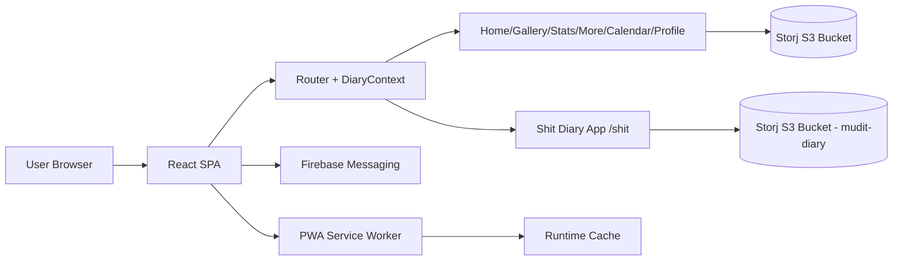
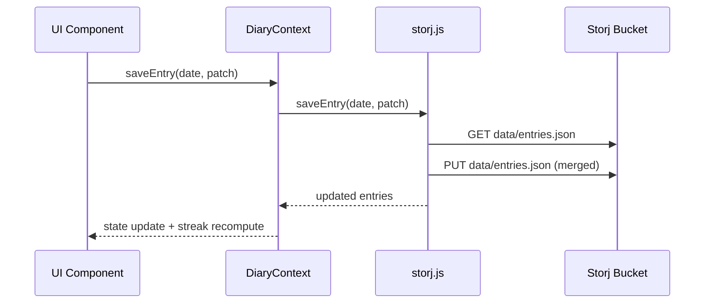

# S3RAEON


-0EA5E9)


> [!IMPORTANT]
> This project is a **client-only journaling PWA** that writes directly to Storj S3-compatible storage from the browser. There is no custom backend service in this repository (source: `package.json`, `src/storj.js`, `vercel.json`).

## TL;DR
S3RAEON is a mobile-first personal journaling app with guided morning voice affirmations, evening reflection, mood tracking, photo memories, searchable history, and analytics. It also contains a second route-scoped diary mode (`/shit`) that uses a separate bucket and theme (source: `src/App.jsx`, `src/apps/ShitDiaryApp.jsx`, `src/pages/*`).

## How It Works in 60 Seconds
1. User unlocks app via password screen; password/security Q&A are loaded from `data/config.json` in Storj (source: `src/components/AuthScreen.jsx`, `src/storj.js`).
2. App loads `data/entries.json` from Storj into `DiaryContext`; streak is computed from entries (source: `src/App.jsx`, `src/utils/streakUtils.js`).
3. Home flow:
   - Morning voice recording window (5:00-9:59 IST) uploads audio to `audio/YYYY-MM-DD-morning.webm`.
   - Photo uploads (max 5/day) go to `photos/YYYY-MM-DD/`.
   - Evening reflection window (from 19:00 IST) stores journal + mood + completion state.
   (source: `src/components/MorningSection.jsx`, `src/components/PhotoSection.jsx`, `src/components/EveningSection.jsx`, `src/utils/timeUtils.js`, `src/storj.js`)
4. Gallery/Calendar/Stats/More pages read same entries and provide filtering, playback, export, and metadata sync actions (source: `src/pages/Gallery.jsx`, `src/pages/Calendar.jsx`, `src/pages/Stats.jsx`, `src/pages/More.jsx`).
5. PWA + service worker caches app assets and Storj gateway responses; Vercel rewrite routes all paths to SPA entry (source: `vite.config.js`, `vercel.json`).

---

## Project Identity

### Purpose
A private journaling and emotional reflection companion designed around daily consistency and rich media capture (voice + photos + text), optimized for single-user use on phone-like UI (source: `src/pages/Home.jsx`, `src/components/*`, `src/index.css`).

### Problem It Solves
- Makes daily journaling structured with time-window prompts.
- Keeps all entries in object storage, avoiding a custom server stack.
- Adds analytics/visual memory surfaces for reflection and habit continuity.
(source: `src/components/MorningSection.jsx`, `src/components/EveningSection.jsx`, `src/storj.js`, `src/pages/Stats.jsx`)

### Target Users (inferred)
- Individuals maintaining a daily reflection habit.
- Single owner/operator deployments with direct bucket credentials.

> [!NOTE]
> **Inferred:** Target user profile is inferred from hardcoded defaults, personal naming, and direct-client credential model (source: `src/profile.js`, `.env.example`, `src/components/AuthScreen.jsx`).

### Product Surface
| Area | Capability | Evidence |
|---|---|---|
| Auth Gate | Setup/login/recovery + alternate mode unlock | `src/components/AuthScreen.jsx` |
| Daily Flow | Morning affirmation recording + evening journal/mood | `src/components/MorningSection.jsx`, `src/components/EveningSection.jsx` |
| Media | Photo upload/view/star + audio playback/refresh | `src/components/PhotoSection.jsx`, `src/components/SmartMedia.jsx` |
| Discovery | Calendar modal day view, Gallery filters, search/voice journey | `src/pages/Calendar.jsx`, `src/pages/Gallery.jsx`, `src/pages/More.jsx` |
| Insights | Streaks, completion, mood trends, heatmap, storage stats | `src/pages/Stats.jsx`, `src/utils/streakUtils.js` |
| Profile | Personal profile + photo + security updates | `src/pages/Profile.jsx`, `src/profile.js` |
| Ops Scripts | Bucket listing, rebuild, restore, refresh, cleanup | `scripts/*.mjs` |

---

## Quick Start

### Prerequisites
- Node.js 18+
- npm
- Storj S3-compatible credentials + bucket
- Optional Firebase project for push notifications
(source: `package.json`, `.env.example`, `src/firebase.js`)

### 1) Install
```bash
npm install
```

### 2) Configure Environment
```bash
cp .env.example .env
```

Required variables:
- `VITE_STORJ_ACCESS_KEY`
- `VITE_STORJ_SECRET_KEY`
- `VITE_STORJ_BUCKET`
- `VITE_STORJ_ENDPOINT`
- `VITE_STORJ_REGION`

Optional Firebase variables:
- `VITE_FIREBASE_API_KEY`
- `VITE_FIREBASE_AUTH_DOMAIN`
- `VITE_FIREBASE_PROJECT_ID`
- `VITE_FIREBASE_STORAGE_BUCKET`
- `VITE_FIREBASE_MESSAGING_SENDER_ID`
- `VITE_FIREBASE_APP_ID`
- `VITE_FIREBASE_VAPID_KEY`
(source: `.env.example`, `src/firebase.js`)

### 3) Run
```bash
npm run dev
```
Vite is configured for port `3000` and auto-open (source: `vite.config.js`).

### 4) Build + Preview
```bash
npm run build
npm run preview
```
(source: `package.json`)

---

## Deep Dive

## Codebase Structure

```text
.
├─ public/                     # PWA icons + Firebase messaging service worker
├─ scripts/                    # Storj maintenance/recovery scripts
├─ src/
│  ├─ apps/                    # Secondary app mode (/shit)
│  ├─ components/              # UI and flow components/modals
│  ├─ data/                    # Static prompts/affirmations JSON
│  ├─ pages/                   # Route pages
│  ├─ utils/                   # Time/streak logic
│  ├─ App.jsx                  # Root state, routing, onboarding, auth gate
│  ├─ storj.js                 # Storj S3 IO + data helpers
│  ├─ firebase.js              # Firebase messaging wiring
│  └─ profile.js               # Profile persistence helpers
├─ vite.config.js              # Vite + PWA runtime caching config
├─ tailwind.config.js          # Tailwind scan + theme extension
├─ vercel.json                 # SPA rewrite
└─ package.json                # deps/scripts
```

### Entry Points and Startup Flow
1. `src/main.jsx` renders `<App />`.
2. `App` checks local onboarding flags and runtime auth state.
3. App loads Storj entries, computes streak, then background-syncs media links.
4. Routes render main app or `/shit` app.
(source: `src/main.jsx`, `src/App.jsx`, `src/apps/ShitDiaryApp.jsx`)

---

## Tech Stack and Why It Exists

| Layer | Tech | Why it is used (from code usage) |
|---|---|---|
| UI | React 18 | Component state + routing + context (`src/App.jsx`, `src/pages/*`) |
| Routing | react-router-dom v6 | Multi-page SPA + nested `/shit/*` app (`src/App.jsx`, `src/apps/ShitDiaryApp.jsx`) |
| Motion | framer-motion | Route/page/modal transitions (`src/pages/*`, `src/components/*`) |
| Charts | recharts | Mood/writing/duration analytics (`src/pages/Stats.jsx`) |
| Date/Time | luxon | IST handling, formatting, calendar math (`src/utils/timeUtils.js`, `src/utils/streakUtils.js`) |
| Storage API | AWS SDK v3 + presigner | Storj S3 compatible object operations + signed URLs (`src/storj.js`, `src/profile.js`) |
| Notifications | Firebase Messaging | Token retrieval + foreground/background message handling (`src/firebase.js`, `public/firebase-messaging-sw.js`) |
| Build | Vite | Dev/build/preview workflow (`package.json`, `vite.config.js`) |
| Styling | Tailwind + custom CSS | Utility classes + custom theme system (`tailwind.config.js`, `src/index.css`) |
| PWA | vite-plugin-pwa | Manifest + service worker + Workbox caching (`vite.config.js`) |

---

## Architecture



### Frontend/Service Boundaries
- No backend service in repo.
- Browser directly performs S3 operations via client credentials.
- Firebase used for push messaging only.
(source: `src/storj.js`, `src/firebase.js`, `package.json`)

### Request/Data Flow

(source: `src/App.jsx`, `src/storj.js`)

### State Management Strategy
- Global shared app state in `DiaryContext`.
- Page/component local state for UI interactions.
- Persistence source of truth: `data/entries.json` in bucket.
(source: `src/App.jsx`, `src/pages/*`, `src/components/*`)

### Background Jobs / Schedulers
- No server workers/queues.
- Client-side background sync of media URLs after initial load (`syncAllMedia`).
- Manual maintenance scripts in `scripts/` for operational repair.
(source: `src/App.jsx`, `src/storj.js`, `scripts/*.mjs`)

### External Integrations
- Storj S3 gateway
- Firebase Cloud Messaging
(source: `src/storj.js`, `src/firebase.js`, `public/firebase-messaging-sw.js`)

---

## Data Layer

### Primary Storage Layout
| Object key/path | Purpose |
|---|---|
| `data/entries.json` | Main journal store |
| `data/config.json` | Password + security recovery values |
| `data/favourites.json` | Starred photo backup map |
| `profile/profile.json` | Profile fields |
| `profile/photo.*` | Profile image |
| `photos/YYYY-MM-DD/*` | Uploaded daily photos |
| `audio/YYYY-MM-DD-morning.webm` | Morning recording |
| `logs/access_logs.json` | Appended access logs |
(source: `src/storj.js`, `src/profile.js`)

### Effective Entry Model (inferred from read/write paths)
```json
{
  "2026-01-07": {
    "journal": "...",
    "mood": 1,
    "prompt": "...",
    "affirmation": "...",
    "morningCompleted": true,
    "eveningCompleted": true,
    "completed": true,
    "audioUrl": "https://...signed...",
    "audioKey": "audio/2026-01-07-morning.webm",
    "audioDuration": 92,
    "photos": [
      {
        "url": "https://...signed...",
        "key": "photos/2026-01-07/1736.jpg",
        "size": 123456,
        "starred": false,
        "uploadedAt": "2026-01-07T..."
      }
    ],
    "updatedAt": "2026-01-07T..."
  }
}
```
(source: `src/storj.js`, `src/components/*`, `src/pages/Stats.jsx`)

### Caching/Sessions
- No server session.
- Local onboarding flags in `localStorage`.
- Signed URLs refreshed client-side when expired/failing.
- PWA caches JS/CSS and Storj gateway runtime requests.
(source: `src/App.jsx`, `src/components/SmartMedia.jsx`, `vite.config.js`)

---

## Auth, Security, Permissions

### Current Model
- App-level password gate before routing into content.
- Password and security Q&A stored in bucket config file.
- Alternate static passphrase enables `/shit` mode.
(source: `src/components/AuthScreen.jsx`, `src/storj.js`)

### Security Safeguards Present
- Basic UI gating and password setup/recovery flow.
- Recovery answer comparison is case-insensitive.
- Some no-cache headers on object reads/writes.
(source: `src/components/AuthScreen.jsx`, `src/storj.js`)

### Security Gaps (critical)
| Gap | Impact | Evidence |
|---|---|---|
| Storj credentials in client env | Anyone with built bundle can extract keys and access bucket scope | `src/storj.js`, `.env.example` |
| Password/security answer stored effectively plaintext | Sensitive secret disclosure risk | `src/components/AuthScreen.jsx`, `src/storj.js` |
| Hardcoded fallback password for `/shit` mode | Unauthorized access if phrase is known | `src/components/AuthScreen.jsx` |
| Firebase config hardcoded in service worker | Key rotation and environment drift risk | `public/firebase-messaging-sw.js` |

> [!WARNING]
> This repository is **not suitable for multi-user or high-security production** without introducing a backend, secret management, and cryptographic password handling.

---

## AI/ML Usage
No AI/ML inference/training pipelines are implemented in this codebase (source: repository scan of `src/`, `scripts/`, `package.json`).

---

## API Surface (Internal + External)

### Internal JS API (Storage/Domain Functions)
| Function | Responsibility |
|---|---|
| `loadEntries`, `saveEntries`, `saveEntry`, `getEntry` | CRUD-like JSON entry persistence |
| `uploadPhoto`, `uploadAudio`, `getPresignedUrl` | Media upload + URL signing |
| `syncAllMedia`, `refreshAllMediaUrls` | Bucket scan/reconciliation |
| `loadConfig`, `saveConfig` | Auth config storage |
| `saveLog` | Append tracking logs |
| `loadFavourites`, `addFavourite`, `removeFavourite` | Favorite backup |
(source: `src/storj.js`)

### External API Contracts
- S3-compatible operations: `GetObject`, `PutObject`, `ListObjectsV2`, `HeadObject`.
- Firebase messaging token and message listeners.
(source: `src/storj.js`, `src/pages/Stats.jsx`, `src/firebase.js`)

### Error Handling Pattern
- Most calls `try/catch` + console logging.
- Many storage failures fall back to empty object/state, reducing hard crashes but risking silent data issues.
(source: `src/storj.js`, `src/App.jsx`, `src/pages/Profile.jsx`)

---

## Frontend UX Map

### Route Map
| Route | Screen |
|---|---|
| `/` | Home |
| `/gallery` | Gallery |
| `/stats` | Stats |
| `/more` | More |
| `/calendar` | Calendar |
| `/profile` | Profile |
| `/shit/*` | Secondary diary app |
(source: `src/App.jsx`, `src/apps/ShitDiaryApp.jsx`)

### Key Interactions
- Morning section locks/unlocks by IST time and enforces minimum recording duration of 60s.
- Evening section locks/unlocks by IST and tracks completion.
- Gallery supports mood filters, favorites, grouping and modal navigation.
- More page provides search, voice-journey, notification setup, and export.
(source: `src/components/MorningSection.jsx`, `src/components/EveningSection.jsx`, `src/pages/Gallery.jsx`, `src/pages/More.jsx`)

### Validation/Loading/Error States
- Loading spinners for app startup, photo upload, profile save/upload, metadata sync.
- Input validations for password setup/change and security updates.
- Error signaling via inline text + alerts + console logs.
(source: `src/App.jsx`, `src/components/AuthScreen.jsx`, `src/pages/Profile.jsx`, `src/pages/Stats.jsx`)

---

## DevEx and Operations

### Commands
| Command | Purpose |
|---|---|
| `npm run dev` | Start Vite dev server on 3000 |
| `npm run build` | Production build |
| `npm run preview` | Local preview of build |
(source: `package.json`, `vite.config.js`)

### Operational Scripts
| Script | What it does |
|---|---|
| `scripts/list-bucket.mjs` | Lists/counts bucket objects by category |
| `scripts/rebuild-entries.mjs` | Rebuilds `entries.json` from bucket objects |
| `scripts/restore-photos.mjs` | Restores missing photos and sizes into entries |
| `scripts/force-refresh-media.mjs` | Regenerates media URLs and updates entries |
| `scripts/cleanup-logs.mjs` | Deletes old logs except `access_logs.json` |
| `scripts/check-shit-entries.mjs` | Checks `mudit-diary/logs` listing |
(source: `scripts/*.mjs`)

### Deployment
- Vercel SPA rewrite sends all paths to root document.
- PWA manifest/runtime cache configured in Vite plugin.
(source: `vercel.json`, `vite.config.js`)

### Observability
- No centralized telemetry/metrics stack.
- Relies on console logs and optional bucket log append.
(source: `src/storj.js`, `src/components/*`)

### Performance Characteristics
- Full `entries.json` object load/save for each logical update can become large-file bottleneck.
- `syncAllMedia` scans whole bucket and regenerates URLs, can be expensive with scale.
(source: `src/storj.js`, `src/App.jsx`)

---

## Testing and Quality

### Current State
- No formal test suite found.
- No lint/typecheck scripts found.
(source: `package.json`, repository file scan)

### Quality Controls Present
- Basic defensive `try/catch` and optimistic UI rollbacks in selected flows.
- Manual repair scripts for data integrity.
(source: `src/App.jsx`, `src/storj.js`, `scripts/*.mjs`)

### Risk Hotspots
1. Direct client credentials and secret storage model.
2. Single-file data persistence (`entries.json`) concurrency/scalability risk.
3. Inconsistent bucket scoping in a few profile/security helpers.
4. Route-specific bug in `/shit` save path.
(source: `src/storj.js`, `src/pages/Profile.jsx`, `src/apps/ShitDiaryApp.jsx`)

---

## Known Issues and Roadmap

### Known Issues (from code evidence)
| Priority | Issue | Evidence |
|---|---|---|
| P0 | `/shit` flow calls `saveEntry` without importing it in `ShitDiaryApp` provider, causing runtime failure when saving | `src/apps/ShitDiaryApp.jsx` |
| P0 | Password/security answer persisted in bucket config without hashing/encryption | `src/components/AuthScreen.jsx`, `src/storj.js` |
| P1 | Profile security update helpers sometimes call `loadConfig()/saveConfig()` without forwarding active bucket name | `src/pages/Profile.jsx` |
| P1 | `DayViewModal` contains unused state/imports and hardcoded bucket fallback (`arshita-diary`) not linked to active context | `src/components/DayViewModal.jsx` |
| P2 | Service worker contains hardcoded Firebase config separate from `.env` model | `public/firebase-messaging-sw.js` |

### Practical Roadmap (prioritized)
1. Move all Storj operations behind backend API and remove client secrets.
2. Replace plaintext password model with salted hash + secure auth/session.
3. Normalize per-entry object persistence (or DB) to avoid whole-file rewrite.
4. Add automated tests for journaling save flows, `/shit` mode, and sync scripts.
5. Add schema validation for `entries.json` and script preflight checks.

---

## Production Readiness Checklist

- [ ] Secrets are server-side only; no storage credentials shipped to browser.
- [ ] Auth uses secure hashing/session; no plaintext credential artifacts.
- [ ] Access controls isolate data by user identity.
- [ ] Data model supports concurrent updates without full-object rewrite conflicts.
- [ ] Error monitoring and alerting integrated.
- [ ] Automated tests cover save, sync, and restore flows.
- [ ] CI validates build/lint/tests before deploy.
- [ ] Backups/versioning enabled for critical object paths.
- [ ] Incident runbooks for bucket corruption/recovery documented.

---

## Troubleshooting Matrix

| Symptom | Likely Cause | How to Verify | Fix |
|---|---|---|---|
| App stuck on loading/empty entries | Storj credential or network issue | Browser console + `loadEntries` failure logs | Validate `.env`, bucket ACL, endpoint (`src/storj.js`) |
| Photos/audio not loading | Expired signed URLs | Check URL query age / load errors | Trigger refresh via app (`SmartMedia`) or `scripts/force-refresh-media.mjs` |
| Cannot unlock app | Missing/invalid `data/config.json` values | Inspect config object in bucket | Re-run setup flow on first launch (`AuthScreen`) |
| `/shit` save fails | Missing `saveEntry` import bug | Reproduce save in `/shit` route | Patch `src/apps/ShitDiaryApp.jsx` to import/use `saveEntry` |
| Stats “sync required” persists | Missing `audioDuration` or photo `size` fields | Banner counts in Stats page | Run in-app sync or rebuild scripts |
| Push notifications not received | FCM permission/token/service worker mismatch | Check token generation + SW logs | Reconfigure Firebase keys and VAPID values |

---

## FAQ

<details>
<summary><strong>Does this project have a backend API server?</strong></summary>

No. The frontend directly reads/writes Storj using AWS SDK from browser code (source: `src/storj.js`).
</details>

<details>
<summary><strong>Where is journal data actually stored?</strong></summary>

In object storage (`data/entries.json`) and media folders under the same bucket (source: `src/storj.js`).
</details>

<details>
<summary><strong>Can I run it without Firebase?</strong></summary>

Yes. Core journaling works without Firebase; only notification features depend on it (source: `src/pages/More.jsx`, `src/firebase.js`).
</details>

<details>
<summary><strong>Why are there two diary modes?</strong></summary>

Primary app routes and `/shit` routes are separate experiences with separate buckets/themes (source: `src/App.jsx`, `src/apps/ShitDiaryApp.jsx`, `src/index.css`).
</details>

---

## Contributing Guide

1. Fork and create a feature branch.
2. Install deps and run `npm run dev`.
3. Keep changes scoped; include evidence-backed notes in PR.
4. Validate build with `npm run build`.
5. If touching data scripts, test against non-production bucket first.

Recommended contribution priorities:
1. Security hardening (credential + auth redesign).
2. `/shit` route save bug fix.
3. Data model migration away from monolithic `entries.json`.
4. Automated testing harness.

---

## License

No license file is currently present in this repository. Add a `LICENSE` file to define usage rights.

---

## Credits / Attribution

- Product/branding content appears personalized in-project.
- Built with React, Vite, Tailwind, Framer Motion, Recharts, Luxon, AWS SDK v3, and Firebase.

---

## Evidence Map

Primary files used for reverse engineering:
- `package.json`
- `vite.config.js`
- `vercel.json`
- `.env.example`
- `src/main.jsx`
- `src/App.jsx`
- `src/storj.js`
- `src/firebase.js`
- `src/profile.js`
- `src/apps/ShitDiaryApp.jsx`
- `src/pages/Home.jsx`
- `src/pages/Gallery.jsx`
- `src/pages/Stats.jsx`
- `src/pages/Calendar.jsx`
- `src/pages/Profile.jsx`
- `src/pages/More.jsx`
- `src/components/AuthScreen.jsx`
- `src/components/MorningSection.jsx`
- `src/components/EveningSection.jsx`
- `src/components/PhotoSection.jsx`
- `src/components/RecordingModal.jsx`
- `src/components/SmartMedia.jsx`
- `src/components/DayViewModal.jsx`
- `src/components/ExportModal.jsx`
- `src/components/Header.jsx`
- `src/components/BottomNav.jsx`
- `src/utils/timeUtils.js`
- `src/utils/streakUtils.js`
- `src/index.css`
- `public/firebase-messaging-sw.js`
- `scripts/list-bucket.mjs`
- `scripts/rebuild-entries.mjs`
- `scripts/restore-photos.mjs`
- `scripts/force-refresh-media.mjs`
- `scripts/cleanup-logs.mjs`
- `scripts/check-shit-entries.mjs`

## Assumptions & Inferences

1. **Single-user intent** is inferred from direct-client secret model, personalized defaults, and lack of multi-tenant auth boundaries.
2. **Target user persona** (personal journaling for individuals/couple context) is inferred from labels/content references and route naming.
3. **Production deployment expectation on Vercel** is inferred from `vercel.json` and existing live-demo reference in `documentation.md`.
4. **Data scale limitations** are inferred from whole-file read/merge/write behavior in `saveEntry` and bucket-wide scans in sync functions.
5. **No AI/ML capability** is inferred from dependency and source scan showing no model SDK usage.

---

## CHANGELOG FOR README

- Rewrote README end-to-end from repository evidence (not previous README) to cover architecture, flows, data model, security, operations, and UX surface.
- Added runnable setup/build commands directly from scripts/config.
- Added Mermaid diagrams for runtime architecture and save flow.
- Added troubleshooting matrix, production-readiness checklist, FAQ, and contribution guidance.
- Added explicit Evidence Map and Assumptions & Inferences sections to distinguish verified facts from inferred conclusions.
